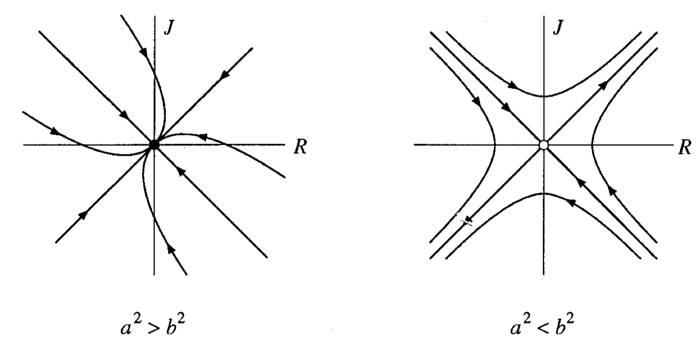

# DynamicalSystems
In this tutorial we will test our knowledge of dynamical systems using the [Brain Dynamics Toolbox](https://bdtoolbox.org/).
Some of the material from this tutorial is based on information developed by Stuart Heitmann (the mind behind the Brain Dynamics Toolbox).

### Dependencies
You will first need to download the [Brain Dynamics Toolbox](https://bdtoolbox.org/): scroll down and press the 'Subscribe and Download' button.
Navigate Matlab to the Brain Dynamics Toolbox directory and add the relevant paths to models (e.g., you may need to `addpath('models')`)

## The linear ODE

A two-dimensional linear system is a good place to start.
Recall:
```math
    dx/dt = a*x + b*y
    dy/dt = c*x + d*y
```
where `a,b,c,d` are constants.

Let's get started:
```matlab
sys = LinearODE();
bdGUI(sys);
```

Have a play of the types of dynamics that are present in the phase portrait and how they depend on the parameters.
Use the `Phase Portrait: Calibrate Axes` to see the full trajectory.
Play with the `Vector Field` option.
Verify that you can set the parameters, alter their ranges for the scale bar, change the initial conditions, and vary the time range over which the system is solved numerically.

Recall the linear system from our tutorial:

```math
    dx/dt = x + y
    dy/dt = 4x - 2y
```

We found that this system has a saddle point at the origin, with eigenvalues `lambda_1 = 2`, `v_1 = [1,1]` and `lambda_2 = -3`, `v_2 = [1,-4]`.

Let's first verify these analytical results by solving the equation in Matlab:
```
A = [1,1;4,-2];
display(eig(A))
```
Looking at the eigenvalues, what sort of dynamics should this system display?

We can even verify the eigenvectors:
```matlab
[v,d] = (eig(A));
% Eigenvalues only tell us a direction so we can rescale for readability:
display(v(:,1)/v(1,1))
display(v(:,2)/v(1,2))
```
Identify the values of `a,b,c,d` for the definition of the linear ODE and use the BDtoolbox to verify the phase portrait presented the lecture:


Let's try with
```matlab
A = [1,-1;10,-2];
lambda = eig(A);
display(lambda)
```

Just looking at the two eigenvalues, `lambda`, what sort of dynamics should this system display?
What sort of dynamics should it have?
Verify your intuition by putting these parameters into `bdtoolbox`.

## Modelling relationships

Imagine two potential lovers, who have feelings for the other that can be captured in the two variables `R` (how Romeo feels for Juliet) and `J` (how Juliet feels for Romeo).
The dynamics of `R` depends on two parameters, `r1` and `r2`, and the dynamics of `J` depends on two parameters `j1` and `j2`:
```
dR/dt = r1*R + r2*J
dJ/dt = j1*R + j2*J
```

While understanding dynamical systems is a useful general skill for physicists, this application in particular is an important skill in life, as it allows one to provide precise mathematical evidence for the fate of either one's own or another's relationship.

### The case of the equally cautious lovers
Imagine the case where Romeo and Juliet respond equivalently to each other.
Then we can reduce the equations above to
```
dR/dt = a*R + b*J
dJ/dt = b*R + a*J
```
Let's consider the cautious case, where `a < 0` (both avoid throwing themselves at each other) and `b > 0` (they both respond positively to advances from the other).

If you analyze the eigenvalues, you find that the fixed point at (R,J) = (0,0), are a saddle point if `|a| < |b|`, and a stable node if `|a| > |b|`:
`v_1 = [1,1]`, `lambda_1 = a+b` and `v_2 = [1,-1]`, `lambda_2 = a-b`.

The phase portrait of this system is here:



Playing with parameters `a` and `b` in the Brain Dynamics Toolkit, including the two regimes identified above.

```matlab
sys = IdenticalLovers();
bdGUI(sys);
```

Start with `|a|` only slightly larger than `|b|` (e.g., `a = -1.2`, `b = 1`), and then start increasing `|a|`.
Can you explain the change in the dynamics in terms of the eigenvalues and eigenvectors of the system?

Note that the `|a| > |b|` condition corresponds to both lovers displaying more cautiousness than enthusiasm. What happens to such a relationship in the long-term?

Note that the `|a| < |b|` case corresponds to both lovers being more daring and sensitive to each other. What are the two outcomes for such a relationship? What determines which of these two outcomes evenuates?

### Optional Extras
Assign names to each of the romantic styles in `dR/dt = aR + bJ`, for the combinations of positive and negative signs of `a` and `b`.
You can experiment with different combinations of lovers in `LinearODE()` in this simple model.
For example:
* What happens when Romeo and Juliet react only to each other but not to themselves? `dR/dt = aJ`, `dJ/dt = bR`.
* Do opposites attract? Copy `IdenticalLovers.m` as `OppositeLovers.m` and modify it such that `dR/dt = aR + bJ`, `dJ/dt = -bR - aJ`.
* Romeo is heartless and lacks self-awareness: `dR/dt = 0`. How does Juliet respond?


### Morris-Lecar model

A conductance-based model of the nerve action potential, involving just two time-varying variables (a simpler form of the four-variable Hodgkin-Huxley model).
The Brain Dynamics Toolbox implementation contains three parameter configurations for three routes to spiking:

1. Hopf bifurcation (firing rate is approximately constant but amplitude varies with injection current),
2. Saddle-node on a limit cycle (amplitude is constant but firing rate varies),
3. Saddle-homoclinic regime (stable fixed point coexists with a stable limit cycle; and can be tristable with the emergence of a stable fixed point within the limit cycle).

### Hodgkin-Huxley Model of Nerve Action Potential

*References*:

* Hodgkin and Huxley (1952). A quantitative description of membrane current and its application to conduction and excitation in a nerve. __J Physiol__ 117:165-181
* Hansel, Mato, Meunier (1993). Phase Dynamics for Weakly Coupled Hodgkin-Huxley Neurons. __Europhys Lett__ 23(5).

The Hodgkin-Huxley (1952) equations describe the action potential in the giant axon of the squid.
The equations explain the rapid rise and fall of the action potential in terms of voltage-gated sodium and potassium channels in the cell membrane.
The model is a classic in computational neuroscience.
Hodgkin and Huxley were awarded the 1963 Nobel Prize in Physiology for this work.

The membrane potential for this model rests at `V = -65 mV` when the injection current `I = 0`.
The resting equilibrium undergoes a subcritical Hopf bifurcation to a repetitive spiking regime when the injection current exceeds `I = 9.78` uAmp/cm2.
Stable resting-state and repetitive spiking solutions coexist for injection currents between `I = 6.27` and `I = 9.78`.
Try mapping out those solutions in the bifurcation panel.
