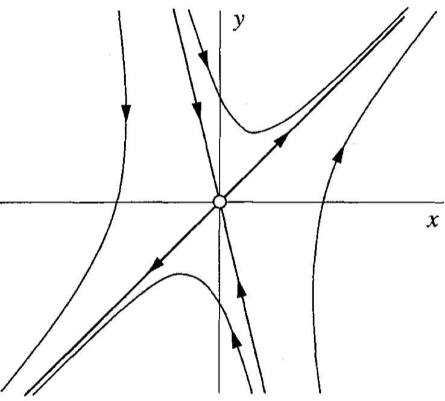
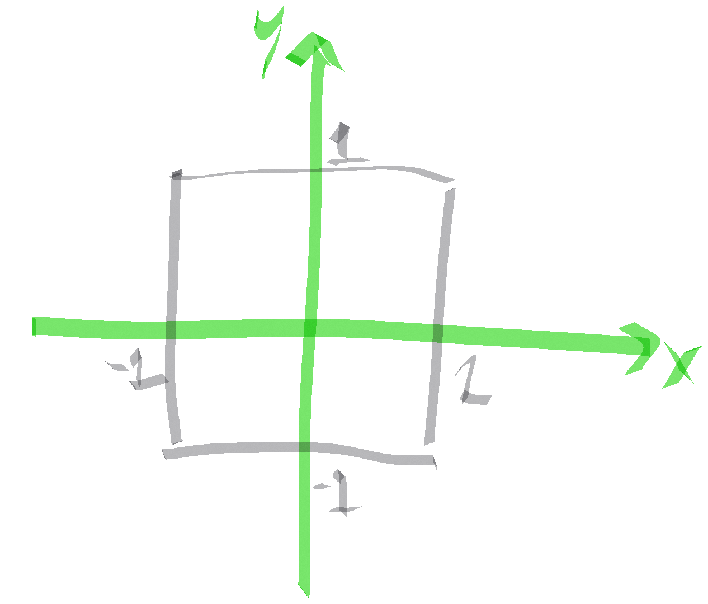
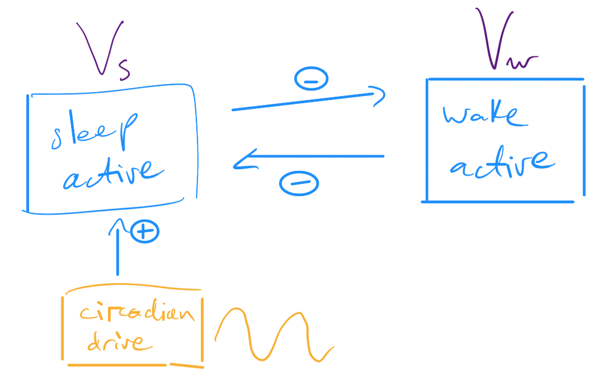

# Dynamics Tutorial

In this tutorial we will test our knowledge of dynamical systems using the [Brain Dynamics Toolbox](https://bdtoolbox.org/).
Some of the material from this tutorial is based on information developed by Stuart Heitmann (the mind behind the Brain Dynamics Toolbox).

## Prework

### Inline functions

Central to coding is the concept of a function, which in general takes in a set of inputs, does some computation on them, and then gives some set of outputs.
In Matlab, you can can write functions in several ways, most commonly as `.m` files that define the inputs, and how to compute outputs from those inputs.
You can also write simple functions inline, as follows:
```matlab
doMeASquarePlease = @(x) x^2;
```
This function defines a computation to perform on an input, `x`, defined using the notation `@(x)`, to produce an output as the square of the input.
You can now use this function with an input of, say, 3:
```matlab
doMeASquarePlease(3)
```

You can also define functions with multiple inputs:
```matlab
makeACopyPlease = @(a,b) [a,b,a,b];
```

This makes a row-vector containing the two inputs concatinated twice in order:
```matlab
makeACopyPlease(3,5)
```

You can also use it for any data type:
```matlab
contradictMe = @(s) [s,' That is incorrect.'];
```

In this case it adds text to my input string:
```matlab
contradictMe('I think this will be a boring tutorial.')
```

Be aware of this `@()` notation for defining inline functions—it can be a handy thing to know about!

### Setting Up

To complete this tutorial, you will first need to __download__ the [_Brain Dynamics Toolbox_](https://sourceforge.net/projects/bdtoolbox/).

To access the functionality of the _Brain Dynamics Toolbox_, you will need to tell Matlab where to look.
Navigate to the directory in which the _Brain Dynamics Toolbox_ is installed and run the following code:
```matlab
% Tell Matlab to look in the current directory:
addpath(pwd)
% Tell Matlab to also look in the models subdirectory:
addpath(fullfile(pwd,'models'))
```

Then move your Matlab directory back to the directory containing the material for this tutorial (all tutorials assume that you will run all code from within the tutorial directory).

Now we're ready to get started.

## Part 1: The Linear Ordinary Differential Equation (ODE)

The two-dimensional linear ODE is a good place to start for understanding basic concepts of linear dynamical systems.

Recall the general form from lectures:


where _a_, _b_, _c_, _d_ are constants.

### Getting a feel for _The Brain Dynamics Toolbox_ (BDT)

Let's get started exploring this simple system using the _BDT_.
Normally you would have to code the equations, direct Matlab to solve them, and then write your own plotting functions to understand the numerical solutions.
The _BDT_ cuts out all of the implementation overhead so we can get straight into exploring and understanding the dynamics :smile:

For the Linear ODE system, we can start an interactive session as follows:
```matlab
% Define the LinearODE system as sys:
sys = LinearODE();
% Open this system in the GUI:
bdGUI(sys);
```

#### Getting familiar with the interactive plots in _BDT_

__HOT TIP__: The 'Phase Portrait: Calibrate' option calibrates the axis limits to reveal the full range of the current trajectory.
1. Verify that the equation solutions are re-evaluated immediately as you change the initial conditions using the slider (also in the 'Time Domain' panel).
   Set a range of initial conditions on `x` and `y` by selecting the 'Initial Conditions' checkbox (and note that this determines the range of `x` and `y` shown in the plots).
   Verify that you can now set specific initial conditions within this range by pressing the 'RAND' button.
2. Turn on the 'Vector Field' option and watch different random trajectories follow the flow.
3. Walk through time by dragging the 'Time Domain' slider.
4. What happens to the dynamics when you alter the model parameters using the scale bar?
   Verify that you can change the parameter ranges shown on the scale bar by checking the 'Parameters' tick box.
5. Find parameter values for which the system:
   - decays to the origin, and
   - spirals out towards infinity.
Verify that you understand these two cases in the 'Time Portrait' and the 'Phase Portrait' views.

### Solving a linear system

Recall the following linear system from lectures:


In lectures, we found that this system has a saddle point at the origin, with eigenvalues `lambda_1 = 2`, `v_1 = [1,1]` and `lambda_2 = -3`, `v_2 = [1,-4]`.

1. Construct the matrix of coefficients for this `[x;y]` linear system in the 2 x 2 matrix, `A`.

2. Numerically verify the eigenvalues that we computed analytically using the `eig` function: `[v,lambda] = eig(A)`.

3. Normalize each eigenvector (columns of `v`) by its first value to verify the eigendirections identified in lectures.

Identify the values of _a_, _b_, _c_, and _d_ for the definition of the linear ODE and use _BDT_ to verify that the vector field is consistent with the qualitative portrait presented the lecture and reproduced below.
(NB: Due to the unstable eigendirection, `v_1`, the system will flow out to infinity, so it helps to set a very tight time range by clicking the 'Time Domain' setting, e.g., up to 2 time units).

Change the initial conditions to verify that you can get the predicted shapes of trajectories shown in the predicted phase portrait.



#### Thinking inside the box :sweat:
Imagine that these equations describe the water currents, and that apart from a safe region near the origin, evil octopuses are rampant :octopus::octopus::octopus:.
A rescue chopper is on its way and will arrive in 15 minutes.

If you can be dropped somewhere on the boundary of the safe zone (defined by `-1 < x < 1` and `-1 < y < 1`), where would you choose to be dropped to give yourself the longest time in safe waters (and thus maximize your chances of being saved).

Use the `TimeToExitBox(x0,y0)` function to evaluate when you first leave the box after starting at `(x0,y0)` (note that this function adds a tiny amount of measurement noise around where you tell it to start).

:question::question::question: What is the longest duration that you can keep the system in the box?
Where did you start the system?



#### :question::question::question: Solve a linear system

Let's try a system with _a_ = 1, _b_ = -1, _c_ = 10, _d_ = -2.

1. What are the eigenvalues of this system?
2. What sort of dynamics should it have?

Verify your prediction by inputting these parameters into `BDT` and playing with initial conditions across an appropriate range.

## Part 2: Modelling two-person romance :couple: :two_men_holding_hands: :two_women_holding_hands:

Imagine two potential lovers, Carrie and Harrison.
Their feelings for each other can be captured in the two variables `H` (how Harrison feels for Carrie) and `C` (how Carrie feels for Harrison).
The dynamics of `C` depends on two parameters, `c1` and `c2`, and the dynamics of `H` depends on two parameters `h1` and `h2`:


While understanding dynamical systems is a useful general skill for physicists, this application allows one to obtain supplementary income as a mathematically rigorous relationship psychic at music festivals :revolving_hearts::crystal_ball:

Imagine that Harrison and Carrie have the same personality and hence respond to each other according to the same rules.
Then we can reduce the four parameters in the full system above to two parameters that reflect this symmetry:


Let's think of time, _t_, as being measured in units of days.

In terms of behaviour in the relationship, can you explain in words what do the parameters _a_ and _b_ correspond to?

### Equally cautious lovers :pensive::pensive:

Let's consider the cautious case, where `a < 0` (both avoid throwing themselves at each other) and `b > 0` (both respond positively to advances from the other).

Think about the eigenvalues/eigenvectors of this system:
`v_1 = [1,1]`, `lambda_1 = a+b` and `v_2 = [1,-1]`, `lambda_2 = a-b`.
(Do you remember from lectures how to compute these results?)

Let's think about the system's stability, determined by the sign of the two eigenvalues.

- What can you say about the second eigenvalue, `lambda_2`?

- What can you say about the first eigenvalue, `lambda_1`?

- Under what conditions is the fixed point, `(H,C) = (0,0)`, a saddle point?
  - When is it a stable node?

- Sketch the phase portrait (on paper) for both the `|a| < |b|` case and the `|a| > |b|` case.

---

Now we have some understanding, let's analyse the system numerically.
The system's equations are implemented in the `IdenticalLovers` file for the _BDT_.
Let's load it up:

```matlab
sys = IdenticalLovers();
bdGUI(sys);
```

Have a quick play with the parameters `a` and `b`.

#### More cautious than enthusiastic: `|a| > |b|`
Remember that we analysing the system with a<0 and b>0, so `|a| > |b|` corresponds to both lovers displaying more cautiousness (|a|) than enthusiasm (|b|).

What happens to such a relationship in the long term?

Start with `|a|` only slightly larger than `|b|` (e.g., `a = -1.2`, `b = 1`): we should have a stable node at the origin.
Since `|lambda_2| > |lambda_1|`, we expect movement to be faster along the `v_2` direction, and then slower along the `v_1` direction toward the origin.
Play with some different initial conditions and verify that the system displays this behavior.

Look at both the Time Portrait and the Phase Portrait (and don't forget to use the 'Calibrate' option if you can't see the grey circle representing the final state of the system).

What do you expect to happen as you increase `|a|` (make `a` more negative)?
Can you verify this behavior?

:question::question::question:
Starting at `(H,C) = (-0.5,1)`, and setting `b = 1`, inspect the Time Portrait to determine the highest value of `a` (i.e., minimal `|a|`) for which love dies (`H < 0.1` and `C < 0.1`) within just three days?
_Hint:_ you may wish to use the 'Time Domain' slider (and the 'Data Cursor').
Give your answer to one decimal place.

#### Daring and responsive: `|a| < |b|`

Recall that we should see a bifurcation at `|a| = |b|`.
Verify this by again starting at `b=1` and `a=-2`, but now increasing `a` and watching the dynamics.

Can you verify that the `v_1` eigendirection becomes unstable after you cross the bifurcation?

The  `|a| < |b|` case corresponds to both lovers being more daring and sensitive to each other.

* What are the two outcomes for such a relationship?
* What determines which of these two outcomes eventuates?


## Part 3: Sleep-Wake Dynamics

We end by analysing a simple mathematical model of the sleep-wake system, developed here at The University of Sydney.
For this tutorial, we have extracted the core elements of the sleep-wake flip-flop: the mutual inhibition between a sleep-active population and wake-active population.
The model defines the mutual inhibition dynamics between two populations: sleep-active, `Vs`, and wake-active, `Vw`.
We consider how this system exhibits flip-flop dynamics in response to a time-varying sleep drive, `Ds` (biologically, this drive is contributed to by the circadian drive, shown orange in the figure below).




### Understanding the model

Let's load up the system:
```matlab
sys = SleepWake();
bdGUI(sys)
```

The model's key variables are `Vs` (sleep) and `Vw` (wake), tell us about how the mean cell-body potential across neurons in each population vary across time.
Here we're going to focus our analysis on the system's fixed points at a given sleep drive, `Ds`.

We start by understanding how population-average voltages can be converted to population-average firing rates using the sigmoid function:
```matlab
Q = @(V) Qmax./(1+exp(-(V-theta)/sigma));
```

Here we have used the `@(x)` syntax to define an inline Matlab function (_described in the prework_).

Plot this function, as `Q` as a function of `V`, for the default values of these three parameters:
```matlab
Qmax = 100; % /s
theta = 10; % mV
sigma = 3; % mV
```

#### :question::question::question: Firing rate function
Using this sigmoidal function, match the mean cell-body potentials relative to resting (mV) to their corresponding firing rates (Hz).
Note where appreciable firing rates (>~1 Hz) emerge.

A sleep state has strong firing in the sleep population (Q > ~1 Hz) but low wake population firing (Q < ~0.1Hz), and vice-versa for a wake state.

### Dynamics in `Vs`-`Vw` space
For default parameters and at sleep drive `Ds = 0`, look at the Phase Portrait of this sleep-wake system.
Click on the 'RAND' button to explore where different initial conditions end up (the grey circle).
Using your knowledge of the relationship between potential (`V`) and firing rate (`Q`), evaluate whether this stable fixed point corresponds to 'sleep' or 'wake'.

Now increase the sleep drive, `Ds = 2`.
Repeat the above, noting where different initial conditions end up, and identifying the final states of the system as either 'sleep' or 'wake'.

Now increase the sleep drive, `Ds = 3`.
Where does the system end up?

### Bifurcation diagram

Our experimenting above demonstrated a dependence of the system's stable states on the sleep drive, `Ds` (including a _bistable region_ where ___both___ sleep and wake are stable).
To understand this structure, we can numerically plot a bifurcation diagram of the system's stable fixed points as a function of `Ds`.
Open the bifurcation panel ('New Panel -> Bifurcation') and use the upper left button (three horizontal lines) do put `Ds` on the _x_-axis and `Vw` on the _y_-axis.

#### :question::question::question: Falling asleep
Set an initial condition corresponding to a wake state, and then slide through values of `Ds` across the range `[0,3.5]`.
At what critical value of `Ds` does the system 'fall to sleep'?
(_you may wish to increase the total time in the Time Domain, e.g., to 20s, to better resolve the critical point_)

#### :question::question::question: Waking up
Set an initial condition corresponding to a sleep state, and then slide through values of `Ds` across the range `[0,3.5]`.
At what critical value of `Ds` does the system 'wake up'?

### Simulating a daily circadian rhythm
Biologically, the sleep drive, `Ds`, has two components: an oscillatory circadian component `C` (with an approximately 24h period), and a homeostatic component, `H`, that grows with time awake and decays during recovery sleep.
We can simulate this daily cycle by varying `Ds` up and down.
Turn on the `evolve` button, which starts the next simulation with an initial condition corresponding to the final state of the previous simulation.
Drag the sleep drive, `Ds`, up and down, simulating cycling between sleep and wake, noting the effect of hysteresis in the model.

Do a few sweeps left and right, saying 'sleep' and 'wake' out aloud whenever the system makes a transition :yum:

#### :question::question::question: Modelling narcolepsy by weakening the flip-flop
One of the theories of how the sleep disorder, narcolepsy, manifests, is through a weakening of the mutual inhibition between the wake-active and sleep-active populations.
Perhaps people born with a reduced level of this inhibition have less robustness in their sleep and wake states (and therefore display narcoleptic symptoms)?

The `v_sw` parameter controls the inhibition strength from the wake population to the sleep population, and in normal humans has an estimated value `v_sw = -2.1`.
Map out the stable sleep and wake states as a function of `Ds` to construct bifurcation diagrams as before, but now repeat this process for progressive reductions in wake-to-sleep inhibition, `v_sw` (you can use the 'Bifurcation -> Clear Axes' functionality to clean things up).
As you repeat this process, determine the value of `v_sw` at which the bistable region disappears.

# :fire: I want more! :fire:

- If you're interested, you can keep playing with more systems listed in the `models` directory of the BDToolbox.
- Some papers describing the sleep-wake model developed here at The University of Sydney are [here](https://dx.doi.org/10.1098/rsta.2011.0120), [here](https://dx.doi.org/10.1103/physreve.78.051920), and [here](https://dx.doi.org/10.1016/j.jtbi.2010.02.028).
