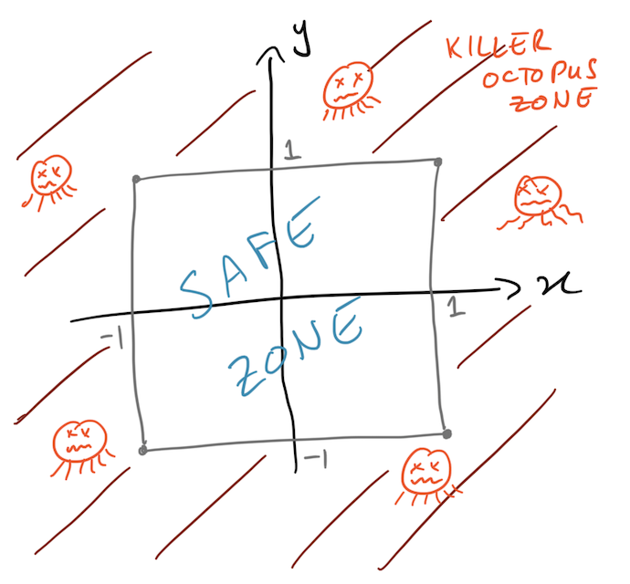

# DynamicalSystems
In this tutorial we will test our knowledge of dynamical systems using the [Brain Dynamics Toolbox](https://bdtoolbox.org/).
Some of the material from this tutorial is based on information developed by Stuart Heitmann (the mind behind the Brain Dynamics Toolbox).

### Dependencies
You will first need to download the [Brain Dynamics Toolbox](https://bdtoolbox.org/): scroll down and press the 'Subscribe and Download' button.
This tutorial assumes that you will be running all code from within this tutorial directory.
To access the functions in the Brain Dynamics Toolbox, you will need to tell Matlab where to look:

Navigate to the directory in which the Brain Dynamics Toolbox is installed and run:
```matlab
% Tell Matlab to look in the current directory:
addpath(pwd)
% Tell Matlab to also look in the models subdirectory:
addpath(fullfile(pwd,'models'))
```

Ok, now let's head back to the tutorial directly, and we're ready to start the tutorial.

## Part 1: The Linear ODE

The two-dimensional linear ordinary differential equation is a good place to start for understanding some basic concepts related to linear dynamical systems.

Recall from lectures that:
```math
dx/dt = ax + by
dy/dt = cx + dy
```
where `a`, `b`, `c`, `d` are constants.

### Getting a feel for The Brain Dynamics Toolbox

Let's get started exploring this simple system using BDToolbox.
Change your path to where you downloaded BDtoolbox and run the following code:
```matlab
% Define the LinearODE system as sys:
sys = LinearODE();
% Open this system in the GUI:
bdGUI(sys);
```

#### Exploring the Phase Portrait
__HOT TIP__: The 'Phase Portrait: Calibrate Axes' option sets the axis limits to reveal the full range of the current trajectory.
1. Verify that the equation solutions are re-evaluated immediately as you change the initial conditions using the slider (also in the 'Time Domain' panel). Set a range of initial conditions on `x` and `y` by selecting the 'Initial Conditions' checkbox (and note that this determines the range of `x` and `y` shown in the plots). Verify that you can now set specific initial conditions within this range by pressing the 'RAND' button.
2. Turn on the 'Vector Field' option and watch different random trajectories follow the flow.
3. Walk through time by dragging the 'Time Domain' slider.
4. What happens to the dynamics when you alter the model parameters using the scale bar? Verify that you can change the parameter ranges shown on the scale bar by checking the 'Parameters' tick box.
5. Find parameter values for which the system: (i) decays to the origin, and (ii) spirals out towards infinity.
Verify that you understand these two cases in the 'Time Portrait' and the 'Phase Portrait' views.

### Solving a specific linear system

Recall the linear system from our tutorial:

```math
dx/dt = x + y
dy/dt = 4x - 2y
```

We found that this system has a saddle point at the origin, with eigenvalues `lambda_1 = 2`, `v_1 = [1,1]` and `lambda_2 = -3`, `v_2 = [1,-4]`.

Construct the matrix of coefficients for this (x,y) linear system in the 2 x 2 matrix, `A`.

Verify the eigenvalues above using the `eig` function: `[v,lambda] = eig(A)`.

Looking at the eigenvalues, `lambda`, what sort of dynamics should this system display?

Normalize each eigenvector (columns of `v`) by its first value to verify the eigendirections identified above.

Identify the values of `a,b,c,d` for the definition of the linear ODE and use the BDtoolbox to verify that the vector field is consistent with the qualitative portrait presented the lecture.
Change the initial conditions to verify that you can get the predicted shapes of trajectories shown in the predicted phase portrait.


#### :question::question::question: Thinking inside the box
If you had the keep the system confined to stay near the origin for the longest possible time, what would your strategy be?
Imagine a box defined by `-1<x<1` and `-1<y<1`.
Where in this region would you start the system for it to stay as close as possible to the origin for as long as possible?

Use the `TimeToExitBox` function to evaluate when you first leave the box (note it adds a tiny amount of noise around where you tell it to start).
What is the longest duration that you can keep the system in the box?
Where did you start the system?



#### :question::question::question: A new linear system

Let's try a system with `a = 1`, `b = -1`, `c = 10`, `d = -2`.

What are the eigenvalues of this system?
What sort of dynamics should it have?
Verify your intuition by inputting these parameters into `bdtoolbox` and playing with different initial conditions across an appropriate range.

## Part 2: Two-person relationships

Imagine two potential lovers, Carrie and Harrison.
Their feelings for each other can be captured in the two variables `H` (how Harrison feels for Carrie) and `C` (how Carrie feels for Harrison).
The dynamics of `C` depends on two parameters, `c1` and `c2`, and the dynamics of `H` depends on two parameters `h1` and `h2`:
```math
dH/dt = h1*H + h2*C
dC/dt = c1*H + c2*C
```

While understanding dynamical systems is a useful general skill for physicists, this application in particular is an important skill in life, as it allows one to provide precise mathematical evidence for the fate of either one's own or another's relationship.

### Equally cautious lovers
Imagine the case where Harrison and Carrie have the same personality and thus respond to each other according to the same rules.
Then we can reduce the equations above to:
```
dH/dt = a*H + b*C
dC/dt = b*H + a*C
```

What does the parameter `a` correspond to here?
What about `b`?

Let's consider the cautious case, where `a < 0` (both avoid throwing themselves at each other) and `b > 0` (both respond positively to advances from the other).

If you analyze the eigenvalues, you find that the fixed point at (H,C) = (0,0), is a saddle point if `|a| < |b|`, and a stable node if `|a| > |b|`:
`v_1 = [1,1]`, `lambda_1 = a+b` and `v_2 = [1,-1]`, `lambda_2 = a-b`.

Sketch the phase portrait in the `|a| < |b|` case and the `|a| > |b|` case.

---

Play with parameters `a` and `b` in the Brain Dynamics Toolkit, including the two regimes identified above:

```matlab
sys = IdenticalLovers();
bdGUI(sys);
```

#### `|a| > |b|`
This condition corresponds to both lovers displaying more cautiousness than enthusiasm.

What happens to such a relationship in the long-term?

Start with `|a|` only slightly larger than `|b|` (e.g., `a = -1.2`, `b = 1`), and then start increasing `|a|`.
Explain the change in the dynamics in terms of the eigenvalues and eigenvectors of the system?
(Look in both the Time Portrait and the Phase Portrait).

:question::question::question: Starting at `(H,C) = (-0.5,1)`, and setting `b = 1`, what is the critical value of `a` that determines whether love will die within five seconds?


#### `|a| < |b|`

The  `|a| < |b|` case corresponds to both lovers being more daring and sensitive to each other.
What are the two outcomes for such a relationship?
What determines which of these two outcomes evenuates?

## Part 3: Sleep-Wake Dynamics
